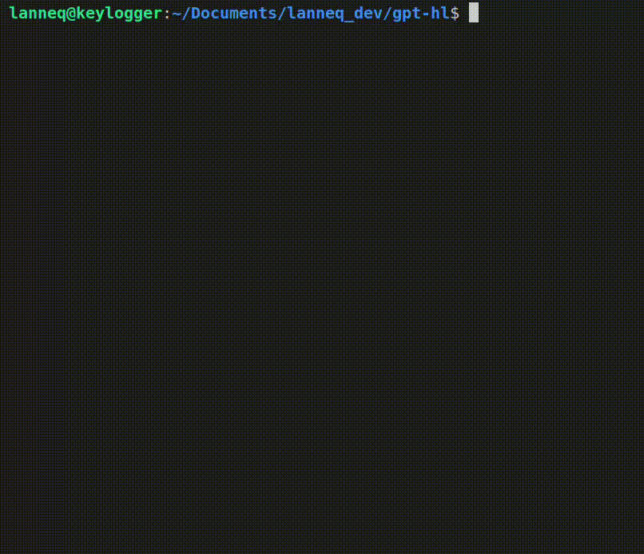

# This is a chatgpt helper for those who like to work only from the terminal and don't want to switch to a browser.

[gpt-hl](https://www.npmjs.com/package/gpt-hl)


Complete the dependencies:
```
npm i gpt-hl
```

Create a gpt.js file and add you openai API_KEY
```
const { Search } = require('gpt-hl');

const gpt = new Search('your openai API_Key')
gpt.run();
```

Run file from terminal 
```
node gpt.js
```

Now you can use terminal for chatting with chatGPT


